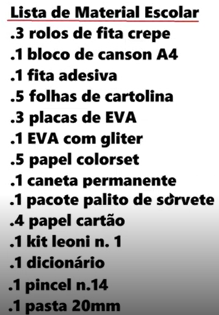
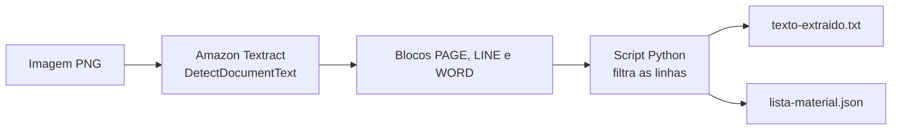
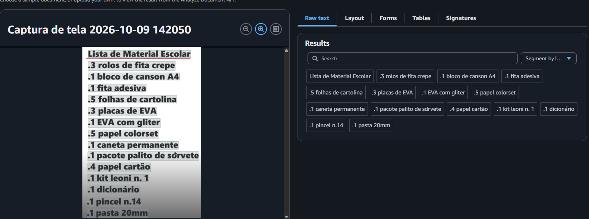
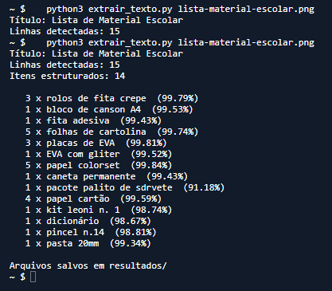

# Extração de texto de imagens com Amazon Textract

Desafio prático do curso **Nublify - Primeiros passos em IA e Cloud**, da [DIO](https://www.dio.me/).

O projeto usa o Amazon Textract para ler uma lista de material escolar a partir de uma imagem e transformar o texto reconhecido em dados estruturados (quantidade e descrição de cada item).

## Imagem de entrada



## Como funciona



1. A imagem é enviada ao Textract pela operação `DetectDocumentText`.
2. O Textract devolve blocos de três tipos: `PAGE`, `LINE` e `WORD`, cada um com o texto, a posição na imagem e um percentual de confiança.
3. O script aproveita apenas os blocos `LINE` e separa cada linha em quantidade e item com uma expressão regular.

## Estrutura do repositório

```
.
├── README.md
├── extrair_texto.py          # script que chama o Textract e organiza o resultado
├── images/                   # imagem de entrada e prints
└── resultados/
    ├── texto-extraido.txt    # linhas detectadas, com a confiança
    └── lista-material.json   # itens estruturados
```

## Processo

### 1. Teste pelo console

No console do Amazon Textract, usei a demonstração de análise de documentos, enviei a imagem e conferi o texto reconhecido na aba de texto bruto.



### 2. Extração com Python

Rodei o script no AWS CloudShell, que já vem com Python, `boto3` e as credenciais da conta, sem precisar criar chaves de acesso.

```bash
python3 extrair_texto.py lista-material-escolar.png
```



## Resultado

```text
Lista de Material Escolar  (99.89%)
.3 rolos de fita crepe  (99.79%)
.1 bloco de canson A4  (99.53%)
.1 fita adesiva  (99.43%)
.5 folhas de cartolina  (99.74%)
.3 placas de EVA  (99.81%)
.1 EVA com gliter  (99.52%)
.5 papel colorset  (99.84%)
.1 caneta permanente  (99.43%)
.1 pacote palito de sdrvete  (91.18%)
.4 papel cartão  (99.59%)
.1 kit leoni n. 1  (98.74%)
.1 dicionário  (98.67%)
.1 pincel n.14  (98.81%)
.1 pasta 20mm  (99.34%)
```

Os arquivos completos estão em [`resultados/`](./resultados/). Exemplo do formato de cada item no JSON:

```json
{
  "quantidade": 3,
  "item": "rolos de fita crepe",
  "confianca": 99.5
}
```

## Insights

- **OCR não é o fim do trabalho**: o Textract devolve texto e posição, mas dar significado a esse texto (o que é quantidade, o que é item) ainda exige uma etapa de tratamento.
- **Confiança por bloco**: cada linha vem com um percentual de confiança, o que permite mandar para revisão humana só o que ficou abaixo de um limite.
- **Ruído da imagem aparece no resultado**: manchas e marcadores, como o ponto antes de cada quantidade, chegam no texto e precisam ser tratados.
- **Hierarquia de blocos**: página, linha e palavra são entregues juntas, então dá para escolher o nível de detalhe conforme a necessidade.
- **Sem servidor e sem treino de modelo**: uma única chamada de API resolve a leitura, pagando por página processada.

## Possibilidades

- Automatizar o fluxo: upload no S3 dispara uma Lambda, que chama o Textract e grava o resultado no DynamoDB.
- Usar `AnalyzeDocument` para extrair tabelas e formulários, e `AnalyzeExpense` para notas fiscais e recibos.
- Enviar o texto extraído ao Amazon Bedrock para classificar os itens ou estimar o custo da lista.
- Digitalizar documentos em lote, como contratos, fichas cadastrais e comprovantes.

## Custos

O `DetectDocumentText` é cobrado por página (US$ 0,0015 nos preços de referência da AWS). Este projeto processa uma única imagem, e contas novas têm um período de gratuidade para o serviço.

## Autor

**Arthur Mamedes Borges** - [@A4thu4](https://github.com/A4thu4)
